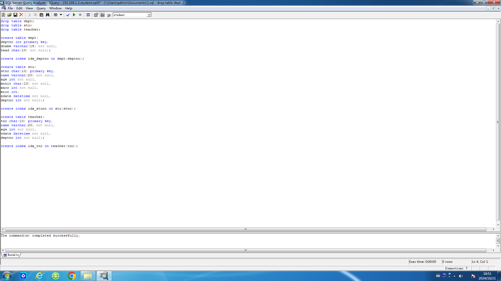
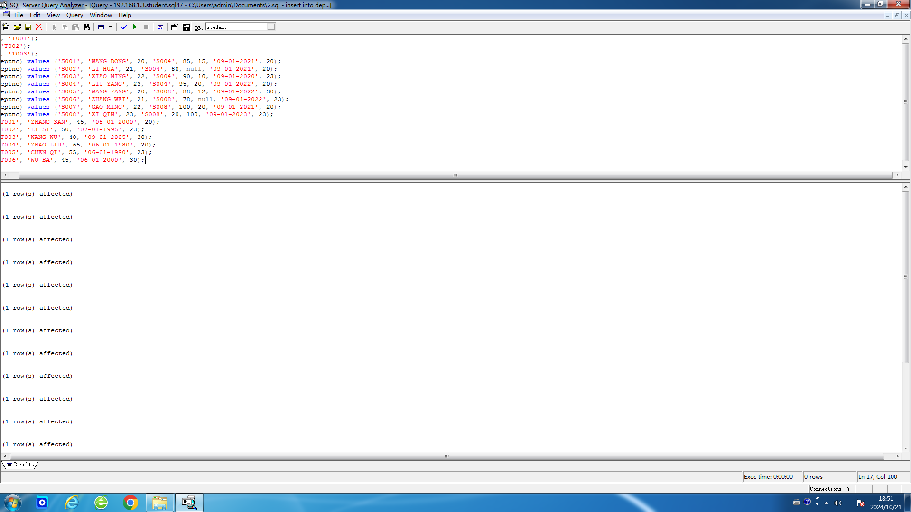
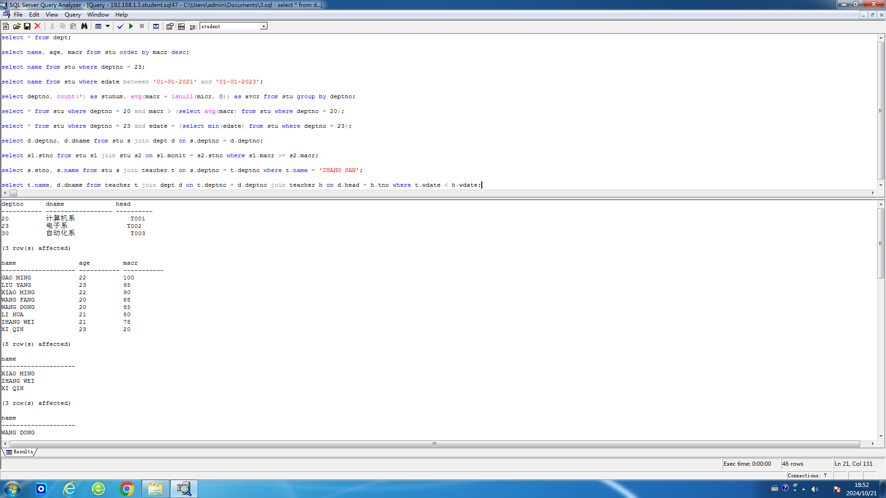
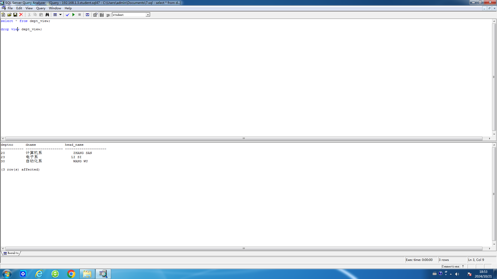
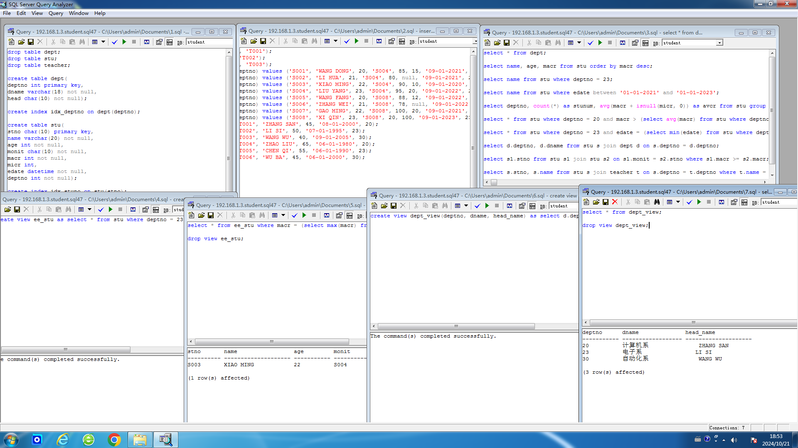

# 数据库实验1

## 实验一 ODBC的设置

### 试验目的：

培养学生对C/S客户机/服务器模式数据库的感性认识，了解SQL Server 2008在安全性、数据完整性、一致性、并发控制等方面的功能，客户端工具的使用方法，以及ODBC的概念与实现。

### 试验内容：

a. ODBC的配置。

### 上机前准备：

了解SQL Server 2008和ODBC的基本概念与原理。

### 试验步骤：

打开计算机后，根据机房的要求，注意保持不联网。然后打开“控制面板”，再选择“管理工具”，选择“数据源（ODBC）”。然后在弹出窗口的“用户DSN”选项卡中选择“添加”，在弹出窗口中选中“SQL Server”。将数据源的“名称”设置为“student”，服务器设置为“192.168.1.3”，登录ID设置为表格中分配给我的登录ID，然后持续点击“下一步”直到设置完成。这样就成功设置了ODBC，可以使用“Microsoft SQL Server 7.0”中的“Query Analyzer”对数据库进行操作了。

## 实验二 SQL语言练习

### 试验目的：

练习并掌握结构化查询语言SQL的语法和程序的编写，以及用Query Analyzer进行查询的方法。

### 试验内容：

a. 用Query Analyzer进行建表/删表、建立索引/删除索引、建立视图/删除视图操作；

b. 用Query Analyzer进行指定的查询。

### 上机前准备：

上机前编写好有关查询程序。

### 试验步骤：

#### 1. 在数据库中建表及其索引

#### 2. 用DROP删除索引和基本表.

由于在我打开数据库后发现已经存在对应名称的表了，可能是上一名使用的同学没有删除。于是我将这两个步骤合并完成。

SQL查询程序如下：

```sql
drop table dept;
drop table stu;
drop table teacher;

create table dept(
deptno int primary key,
dname varchar(18) not null,
head char(10) not null);

create index idx_deptno on dept(deptno);

create table stu(
stno char(10) primary key,
name varchar(20) not null,
age int not null,
monit char(10) not null,
macr int not null,
micr int,
edate datetime not null,
deptno int not null);

create index idx_stuno on stu(stno);

create table teacher(
tno char(10) primary key,
name varchar(20) not null,
age int not null,
wdate datetime not null,
deptno int not null);

create index idx_tno on teacher(tno);
```

响应如下：

```
The command(s) completed successfully.
```



这样，我们就成功建立了包含对应字段的DEPT表（系信息表）、STU表（学生信息表）、TEACHER表（教师信息表），并分别为其第一列建立索引，以加快查询速度。

#### 3. 用INSERT语句向3个表中各插入若干数据，数据自己设计，要保证下面的每个查询有结果。

SQL查询程序如下：

```sql
insert into dept (deptno, dname, head) values (20, '计算机系', 'T001');
insert into dept (deptno, dname, head) values (23, '电子系', 'T002');
insert into dept (deptno, dname, head) values (30, '自动化系', 'T003');
insert into stu (stno, name, age, monit, macr, micr, edate, deptno) values ('S001', 'WANG DONG', 20, 'S004', 85, 15, '09-01-2021', 20);
insert into stu (stno, name, age, monit, macr, micr, edate, deptno) values ('S002', 'LI HUA', 21, 'S004', 80, null, '09-01-2021', 20);
insert into stu (stno, name, age, monit, macr, micr, edate, deptno) values ('S003', 'XIAO MING', 22, 'S004', 90, 10, '09-01-2020', 23);
insert into stu (stno, name, age, monit, macr, micr, edate, deptno) values ('S004', 'LIU YANG', 23, 'S004', 95, 20, '09-01-2022', 20);
insert into stu (stno, name, age, monit, macr, micr, edate, deptno) values ('S005', 'WANG FANG', 20, 'S008', 88, 12, '09-01-2022', 30);
insert into stu (stno, name, age, monit, macr, micr, edate, deptno) values ('S006', 'ZHANG WEI', 21, 'S008', 78, null, '09-01-2022', 23);
insert into stu (stno, name, age, monit, macr, micr, edate, deptno) values ('S007', 'GAO MING', 22, 'S008', 100, 20, '09-01-2021', 20);
insert into stu (stno, name, age, monit, macr, micr, edate, deptno) values ('S008', 'XI QIN', 23, 'S008', 20, 100, '09-01-2023', 23);
insert into teacher (tno, name, age, wdate, deptno) values ('T001', 'ZHANG SAN', 45, '08-01-2000', 20);
insert into teacher (tno, name, age, wdate, deptno) values ('T002', 'LI SI', 50, '07-01-1995', 23);
insert into teacher (tno, name, age, wdate, deptno) values ('T003', 'WANG WU', 40, '09-01-2005', 30);
insert into teacher (tno, name, age, wdate, deptno) values ('T004', 'ZHAO LIU', 65, '06-01-1980', 20);
insert into teacher (tno, name, age, wdate, deptno) values ('T005', 'CHEN QI', 55, '06-01-1990', 23);
insert into teacher (tno, name, age, wdate, deptno) values ('T006', 'WU BA', 45, '06-01-2000', 30);
```

响应如下：

```
(1 row(s) affected)
(1 row(s) affected)
(1 row(s) affected)
(1 row(s) affected)
(1 row(s) affected)
(1 row(s) affected)
(1 row(s) affected)
(1 row(s) affected)
(1 row(s) affected)
(1 row(s) affected)
(1 row(s) affected)
(1 row(s) affected)
(1 row(s) affected)
(1 row(s) affected)
(1 row(s) affected)
(1 row(s) affected)
(1 row(s) affected)
```



说明我们成功向3个表中插入了上述数据。

#### 4. 练习使用SELECT语句进行数据查询，完成以下查询：

SQL查询程序如下：

```sql
-- （1）查询DEPT中有哪些数据。
select * from dept;
-- （2）查询每个学生的姓名、年龄和主修学分，并按照主修学分由高到低排序。
select name, age, macr from stu order by macr desc;
-- （3）查询23号系的学生姓名。
select name from stu where deptno = 23;
-- （4）查询入学日期在2021.1.1与2023.1.1之间的学生姓名。
select name from stu where edate between '01-01-2021' and '01-01-2023';
-- （5）按系给出学生人数以及所选学分（主修+辅修）的平均值。
select deptno, count(*) as stunum, avg(macr + isnull(micr, 0)) as avcr from stu group by deptno;
-- （6）查询DEPTNO=20的所有主修学分大于平均主修学分的学生信息。
select * from stu where deptno = 20 and macr > (select avg(macr) from stu where deptno = 20);
-- （7）查询入学时间最早且系编号为23的学生信息。
select * from stu where deptno = 23 and edate = (select min(edate) from stu where deptno = 23);
-- （8）查询学生WANG DONG所在的系的名称和编号。
select d.deptno, d.dname from stu s join dept d on s.deptno = d.deptno;
-- （9）将学生学分与其班长相比，查出其主修学分至少与其班长相同的学生学号。
select s1.stno from stu s1 join stu s2 on s1.monit = s2.stno where s1.macr >= s2.macr;
-- （10）查与教师ZHANG SAN同系的学生学号和姓名。
select s.stno, s.name from stu s join teacher t on s.deptno = t.deptno where t.name = 'ZHANG SAN';
-- （11）查参加工作时间比其所在系的系主任早的教师姓名和所在的系名。
select t.name, d.dname from teacher t join dept d on t.deptno = d.deptno join teacher h on d.head = h.tno where t.wdate < h.wdate;
```

响应如下：
    
```
deptno      dname              head       
----------- ------------------ ---------- 
20          计算机系               T001      
23          电子系                T002      
30          自动化系               T003      

(3 row(s) affected)

name                 age         macr        
-------------------- ----------- ----------- 
GAO MING             22          100
LIU YANG             23          95
XIAO MING            22          90
WANG FANG            20          88
WANG DONG            20          85
LI HUA               21          80
ZHANG WEI            21          78
XI QIN               23          20

(8 row(s) affected)

name                 
-------------------- 
XIAO MING
ZHANG WEI
XI QIN

(3 row(s) affected)

name                 
-------------------- 
WANG DONG
LI HUA
LIU YANG
WANG FANG
ZHANG WEI
GAO MING

(6 row(s) affected)

deptno      stunum      avcr        
----------- ----------- ----------- 
20          4           103
23          3           99
30          1           100

(3 row(s) affected)

stno       name                 age         monit      macr        micr        edate                       deptno      
---------- -------------------- ----------- ---------- ----------- ----------- --------------------------- ----------- 
S004       LIU YANG             23          S004       95          20          2022-09-01 00:00:00.000     20
S007       GAO MING             22          S008       100         20          2021-09-01 00:00:00.000     20

(2 row(s) affected)

stno       name                 age         monit      macr        micr        edate                       deptno      
---------- -------------------- ----------- ---------- ----------- ----------- --------------------------- ----------- 
S003       XIAO MING            22          S004       90          10          2020-09-01 00:00:00.000     23

(1 row(s) affected)

deptno      dname              
----------- ------------------ 
20          计算机系
20          计算机系
23          电子系
20          计算机系
30          自动化系
23          电子系
20          计算机系
23          电子系

(8 row(s) affected)

stno       
---------- 
S004      
S005      
S006      
S007      
S008      

(5 row(s) affected)

stno       name                 
---------- -------------------- 
S001       WANG DONG
S002       LI HUA
S004       LIU YANG
S007       GAO MING

(4 row(s) affected)

name                 dname              
-------------------- ------------------ 
ZHAO LIU             计算机系
CHEN QI              电子系
WU BA                自动化系

(3 row(s) affected)
```



可见这些查询都成功进行，并且都有结果。

#### 5. 建立/查询/删除VIEW视图

由于建立VIEW的语句似乎无法和其他语句写在一起执行，于是我将它们分开写并执行。

（1）建立电子系学生视图EE_STU。

SQL查询程序如下：

```sql
create view ee_stu as select * from stu where deptno = 23
```

响应如下：

```
The command(s) completed successfully.
```


（3）查视图EE_STU中主修学分最高的学生信息。（5）删除视图EE_STU。

SQL查询程序如下：

```sql
select * from ee_stu where macr = (select max(macr) from ee_stu);
drop view ee_stu;
```

响应如下：

```
stno       name                 age         monit      macr        micr        edate                       deptno      
---------- -------------------- ----------- ---------- ----------- ----------- --------------------------- ----------- 
S003       XIAO MING            22          S004       90          10          2020-09-01 00:00:00.000     23

(1 row(s) affected)
```


（2）建立系号、系名、系主任姓名的系视图DEPT_VIEW。

SQL查询程序如下：

```sql
create view dept_view(deptno, dname, head_name) as select d.deptno, d.dname, t.name from dept d join teacher t on d.head = t.tno
```

响应如下：

```
The command(s) completed successfully.
```


（4）列出系视图DEPT_VIEW的全部信息。（5）删除视图DEPT_VIEW。

SQL查询程序如下：

```sql
select * from dept_view;
drop view dept_view;
```

响应如下：

```
deptno      dname              head_name            
----------- ------------------ -------------------- 
20          计算机系               ZHANG SAN
23          电子系                LI SI
30          自动化系               WANG WU

(3 row(s) affected)
```



最后是包含所有SQL程序的图片：



可见，完成了实验的所有步骤。我从此次实验中学习了SQL的语法和程序的编写，受益匪浅。
