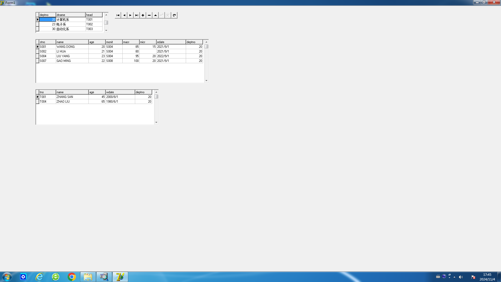
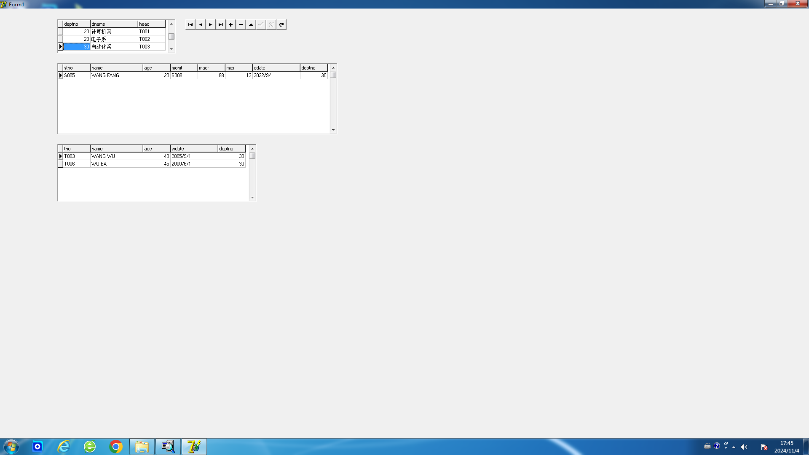
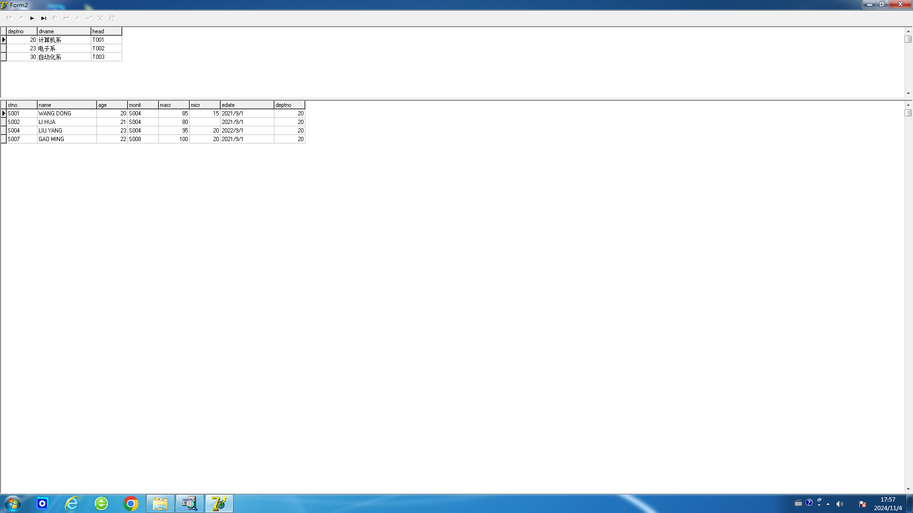
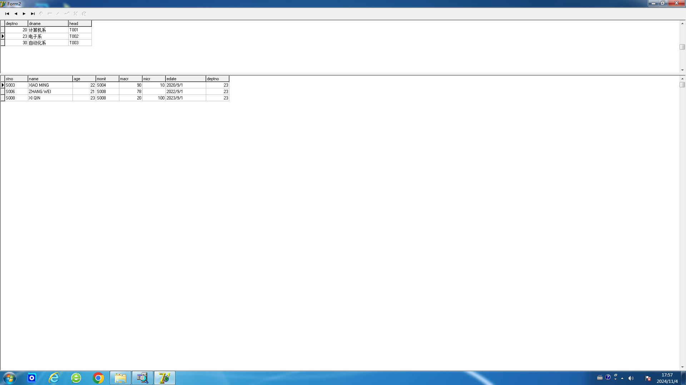
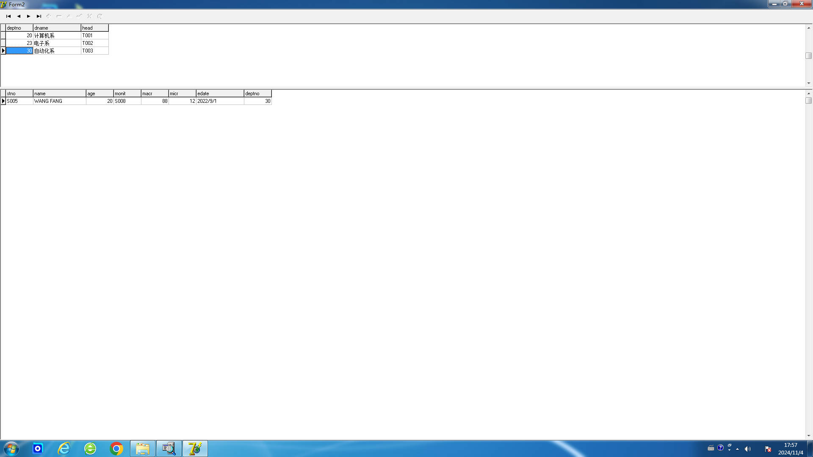

# 数据库实验2

## 实验三 Delphi开发应用程序

### 试验目的：

熟悉利用Borland Delphi 7进行数据库应用的开发，了解开发C/S模式下数据库前端应用的一些基本思路与核心技术，掌握面向对象的程序设计以及可视化编程的一般方法。

### 试验内容：

a. 用Delphi手动编程方式，将试验二中建立的DEPT、STU、TEACHER关系，建成主从表的形式，DEPT为主表，STU、TEACHER为DEPT的两个从表。

b. 用Delphi自动编程方式，将试验二中建立的DEPT、STU关系，建成主从表的形式，DEPT为主表，STU为从表。

### 上机前准备：

上机前认真阅读《第二次数据库上机说明.pptx》，搞清一些基本概念：BDE、Table、DataSource、显示窗等, 各种控件。如果可能，参阅有关Delphi 7的操作说明手册或文献。

### 试验步骤：

按照课上所讲内容：《第二次数据库上机说明.pptx》。

用Delphi手动编程方式，将试验二中建立的DEPT、STU、TEACHER关系，建成主从表的形式，DEPT为主表，STU、TEACHER为DEPT的两个从表。

选择其他DEPT，可以切换STU和TEACHER。

用Delphi自动编程方式，将试验二中建立的DEPT、STU关系，建成主从表的形式，DEPT为主表，STU为从表。

选择其他DEPT，可以切换STU和TEACHER。

