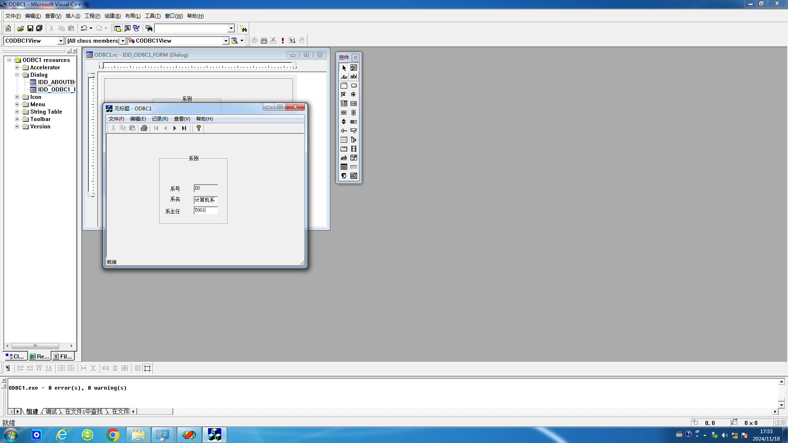
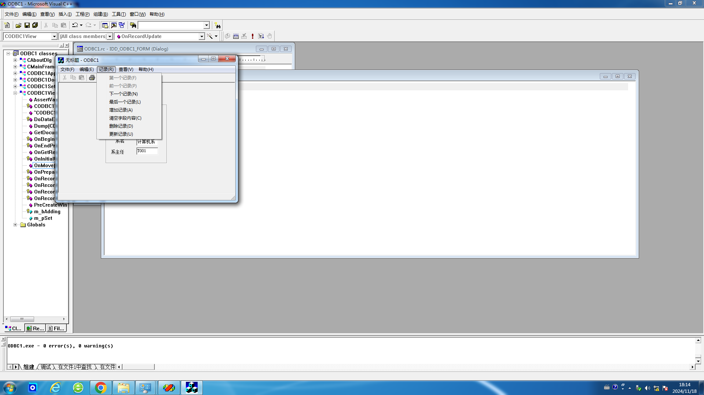
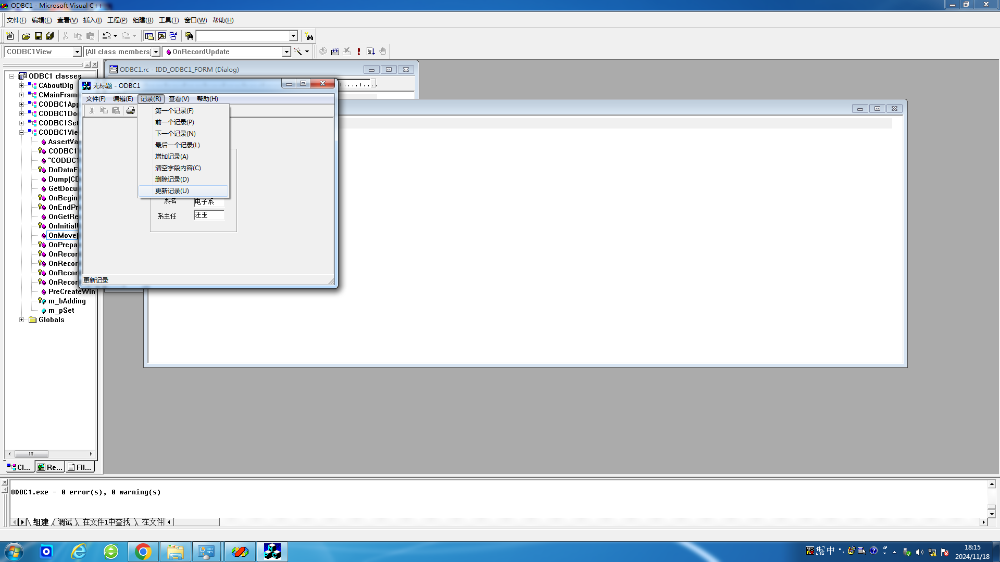
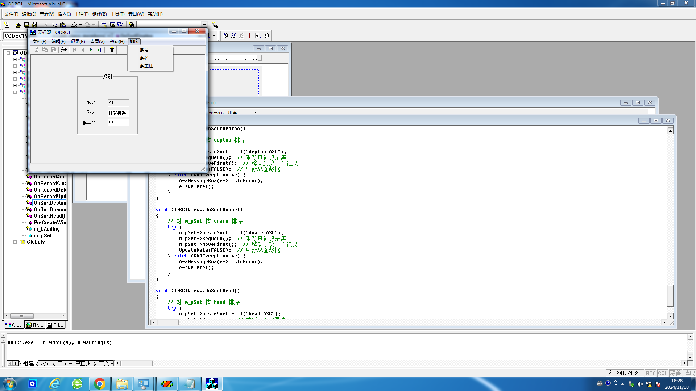

# 数据库实验3

## 实验四 用VC++开发数据库应用程序

### 试验目的：

熟悉利用Microsoft Visual C++进行数据库ODBC应用程序的开发，掌握面向对象的程序设计以及可视化编程的一般方法。

### 试验内容：

用VC++自动和手动混合编程，将实验二中建立的DEPT、STU、TEACHER关系（可以任选两个），按照下面操作说明的步骤，给每个关系建立一个窗口式用户客户端界面，实现关系元组的显示、插入、删除、更新、清空的功能。

### 上机前准备：

上机前认真阅读实验指示书3的操作说明，搞清其中的含义。可参阅VC++6.0或其它更高版本编译器的操作手册和有关书籍。

### 试验步骤：

按照实验指示书3的操作说明进行。

首先生成数据库应用程序框架，显示数据库表中数据。

这是搭建好的界面。



然后实现数据库的增加、删除、更新和清空记录功能，编写命令消息的代码。

这是设置好的下拉菜单。



使用“更新记录”把“电子系”的系主任更新为“汪玉”。



经检验，确实可以实现添加的各项功能。代码如下：

构造函数：

```cpp
CODBC1View::CODBC1View()
	: CRecordView(CODBC1View::IDD)
{
	//{{AFX_DATA_INIT(CODBC1View)
	m_pSet = NULL;
	//}}AFX_DATA_INIT
	// TODO: add construction code here
	m_bAdding = FALSE;
}
```

各函数：

```cpp
void CODBC1View::OnRecordAdd() 
{
	// TODO: Add your command handler code here
	m_pSet->AddNew();
	m_bAdding = TRUE;
	// 将第一个字段改为可读写
	CEdit *pCtrl = (CEdit *)GetDlgItem(IDC_DEPTNO);
	int result = pCtrl->SetReadOnly(FALSE);
	UpdateData(FALSE);
}

void CODBC1View::OnRecordClearfields() 
{
	// TODO: Add your command handler code here
	m_pSet->SetFieldNull(NULL);
	UpdateData(FALSE);
}

void CODBC1View::OnRecordDelete() 
{
	// TODO: Add your command handler code here
	try {
		m_pSet->Delete();
	}
	catch (CDBException *e) {
		AfxMessageBox(e->m_strError);
		e->Delete();
		m_pSet->MoveFirst();
		UpdateData(FALSE);
		return;
	}
	if (m_pSet->IsEOF())
		m_pSet->MoveLast();
	if (m_pSet->IsBOF())
		m_pSet->SetFieldNull(NULL);
	UpdateData(FALSE);
}

void CODBC1View::OnRecordUpdate() 
{
	// TODO: Add your command handler code here
	m_pSet->Edit();
	UpdateData(TRUE);
	if (m_pSet->CanUpdate())
		m_pSet->Update();
}

BOOL CODBC1View::OnMove(UINT nIDMoveCommand) 
{
	// TODO: Add your specialized code here and/or call the base class
	if (m_bAdding) {
		m_bAdding = FALSE;
		UpdateData(TRUE);
		// 调用 Update
		if (m_pSet->CanUpdate())
		m_pSet->Update();
		//将增加的记录移动到最后
		if (!m_pSet->IsEOF())
		m_pSet->MoveLast();
		m_pSet->Requery();
		UpdateData(FALSE);
		// 将第一个字段恢复为只读
		CEdit *pCtrl = (CEdit *)GetDlgItem(IDC_DEPTNO);
		pCtrl->SetReadOnly(TRUE);
		return TRUE;
	}
	else {
		switch (nIDMoveCommand)
		{
		case ID_RECORD_PREV:
			m_pSet->MovePrev();
			if (!m_pSet->IsEOF())
				break;
		case ID_RECORD_FIRST:
			m_pSet->MoveFirst();
			break;
		case ID_RECORD_NEXT:
			m_pSet->MoveNext();
			if (!m_pSet->IsEOF())
				break;
			if (!m_pSet->CanScroll()){
				m_pSet->SetFieldNull(NULL);
				break;
			}
		case ID_RECORD_LAST:
			m_pSet->MoveLast();
			break;
		default:
			ASSERT(FALSE);
		}
		UpdateData(FALSE); // 显示移动操作的结果
		return TRUE;
	}
	return CRecordView::OnMove(nIDMoveCommand);
}
```

除此之外，还可以在菜单栏中增加一个新菜单，例如，增加“排序”菜单，方法是在ResourceView中，展开Menu，双击“IDR_MAINFRAME”，在菜单栏的最右边空白虚线方块内双击鼠标，就可以输入新菜单名“排序”，再按照前面在菜单中增加菜单选项的步骤，例如，增加“系号”，“系名”，“系主任”及其处理函数。



经检验，确实可以实现排序功能。添加的函数如下：

```cpp
void CODBC1View::OnSortDeptno()
{
    // 对 m_pSet 按 deptno 排序
    try {
        m_pSet->m_strSort = _T("deptno ASC");
        m_pSet->Requery();  // 重新查询记录集
        m_pSet->MoveFirst();  // 移动到第一个记录
        UpdateData(FALSE);  // 刷新界面数据
    } catch (CDBException *e) {
        AfxMessageBox(e->m_strError);
        e->Delete();
    }
}

void CODBC1View::OnSortDname()
{
    // 对 m_pSet 按 dname 排序
    try {
        m_pSet->m_strSort = _T("dname ASC");
        m_pSet->Requery();  // 重新查询记录集
        m_pSet->MoveFirst();  // 移动到第一个记录
        UpdateData(FALSE);  // 刷新界面数据
    } catch (CDBException *e) {
        AfxMessageBox(e->m_strError);
        e->Delete();
    }
}

void CODBC1View::OnSortHead()
{
    // 对 m_pSet 按 head 排序
    try {
        m_pSet->m_strSort = _T("head ASC");
        m_pSet->Requery();  // 重新查询记录集
        m_pSet->MoveFirst();  // 移动到第一个记录
        UpdateData(FALSE);  // 刷新界面数据
    } catch (CDBException *e) {
        AfxMessageBox(e->m_strError);
        e->Delete();
    }
}
```