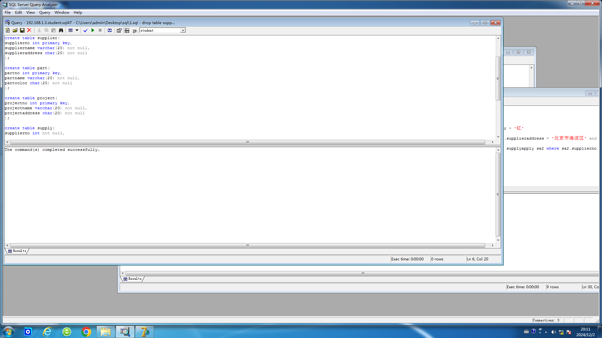

# 数据库实验4

## 实验五 数据库设计与实现

### 试验目的：

熟悉掌握数据库设计开发的整个过程。

### 试验内容：

a. 从需求分析入手，按数据库设计的方法和步骤设计并在计算机上实现一个数据库：供应商――－零件―――工程。已知语义是：

（1）一个供应商可以提供多种零件；而每种零件由多个供应商供应；

（2）每种零件为多个工程使用，而每项工程又需要多种零件;

（3）每个供应商有姓名、编号和住址；每种零件有零件名、编号、颜色；每项工程有工程名、编号和地址。

b. 在从此数据库基础上编写小应用程序实现以下查询功能：

（1）给出为某项工程提供零件的全部供应商名；

（2）给出使用某供应商所供零件的全部工程名；

（3）给出使用红色零件的工程名；

（4）给出住在A地而为不在A地、且不使用红色零件的工程提供零件的供应商名；

（5）给出使用某供应商供应的全部零件的工程名。

### 上机前准备：

（1）按数据库设计的要求画出详细的E-R图；

（2）给出数据模型和关系模式；

（3）自己设计合理的数据录入数据库中，最好能使得所有前面的查询都有结果；

（4）编写好应用程序。用Delphi或VC++都可以，应用程序的界面应该尽量友好方便，比如按钮方式等。

### 试验步骤：

首先按照数据库设计的要求画出详细的E-R图。


根据这个E-R图，可以给出如下数据模型和关系模式：

- 供应商`supplier`（姓名`suppliername`、编号`supplierno`、住址`supplieraddress`）

- 零件`part`（零件名`partname`、编号`partno`、颜色`partcolor`）

- 工程`project`（工程名`projectname`、编号`projectno`、地址`projectaddress`）

- 提供`supply`（供应商编号`supplierno`、零件编号`partno`）

- 使用`apply`（零件编号`partno`、工程编号`projectno`）

然后用以下SQL语句建立相应的表。为了后续语句书写简便起见，我在建立`supply`和`apply`之后将其合并为`supplyapply`。

```sql
create table supplier(
supplierno int primary key,
suppliername varchar(20) not null,
supplieraddress char(20) not null
);

create table part(
partno int primary key,
partname varchar(20) not null,
partcolor char(20) not null
);

create table project(
projectno int primary key,
projectname varchar(20) not null,
projectaddress char(20) not null
);

create table supply(
supplierno int not null,
partno int not null,
primary key (supplierno, partno)
);

create table apply(
partno int not null,
projectno int not null,
primary key (partno, projectno)
);

create table supplyapply(
supplierno int not null,
partno int not null,
projectno int not null,
primary key (supplierno, partno, projectno)
);
```

结果如下：

```
The command(s) completed successfully.
```



用以下SQL语句添加数据，并将`supply`和`apply`的数据合并到`supplyapply`中去。

```sql
insert into supplier (supplierno, suppliername, supplieraddress) values (101, '华清', '北京市海淀区');
insert into supplier (supplierno, suppliername, supplieraddress) values (102, '大北', '北京市海淀区');
insert into supplier (supplierno, suppliername, supplieraddress) values (103, '旦复', '上海市杨浦区');
insert into part (partno, partname, partcolor) values (201, '螺母', '紫');
insert into part (partno, partname, partcolor) values (202, '螺丝', '红');
insert into part (partno, partname, partcolor) values (203, '螺丝刀', '蓝');
insert into part (partno, partname, partcolor) values (204, '钢钉', '银');
insert into part (partno, partname, partcolor) values (205, '垫片', '红');
insert into project (projectno, projectname, projectaddress) values (301, '螺母楼扩建', '北京市海淀区');
insert into project (projectno, projectname, projectaddress) values (302, '紫金公寓改造', '北京市海淀区');
insert into project (projectno, projectname, projectaddress) values (303, '太空电梯建设', '印度尼西亚');
insert into project (projectno, projectname, projectaddress) values (304, '地心钻探', '俄罗斯');
insert into supply (supplierno, partno) values (101, 201);
insert into supply (supplierno, partno) values (101, 203);
insert into supply (supplierno, partno) values (102, 202);
insert into supply (supplierno, partno) values (102, 204);
insert into supply (supplierno, partno) values (102, 205);
insert into supply (supplierno, partno) values (103, 201);
insert into supply (supplierno, partno) values (103, 202);
insert into supply (supplierno, partno) values (103, 205);
insert into apply (partno, projectno) values (201, 301);
insert into apply (partno, projectno) values (201, 302);
insert into apply (partno, projectno) values (202, 303);
insert into apply (partno, projectno) values (203, 301);
insert into apply (partno, projectno) values (203, 302);
insert into apply (partno, projectno) values (203, 303);
insert into apply (partno, projectno) values (204, 304);
insert into supplyapply (supplierno, partno, projectno) select supp.supplierno, app.partno, app.projectno from supply supp join apply app on supp.partno = app.partno;
```

结果如下：

```
(1 row(s) affected)
(1 row(s) affected)
(1 row(s) affected)
(1 row(s) affected)
(1 row(s) affected)
(1 row(s) affected)
(1 row(s) affected)
(1 row(s) affected)
(1 row(s) affected)
(1 row(s) affected)
(1 row(s) affected)
(1 row(s) affected)
(1 row(s) affected)
(1 row(s) affected)
(1 row(s) affected)
(1 row(s) affected)
(1 row(s) affected)
(1 row(s) affected)
(1 row(s) affected)
(1 row(s) affected)
(1 row(s) affected)
(1 row(s) affected)
(1 row(s) affected)
(1 row(s) affected)
(1 row(s) affected)
(1 row(s) affected)
(1 row(s) affected)
(10 row(s) affected)
```


上面提到的查询功能分别用以下SQL语句实现：

```sql
select distinct s.suppliername from supplier s join supplyapply sa on s.supplierno = sa.supplierno where sa.projectno = 301

select distinct pr.projectname from project pr join supplyapply sa on pr.projectno = sa.projectno where sa.supplierno = 101

select distinct pr.projectname from project pr join supplyapply sa on pr.projectno = sa.projectno join part pa on sa.partno = pa.partno where pa.partcolor = '红'

select distinct s.suppliername from supplier s join supplyapply sa on s.supplierno = sa.supplierno join project pr on pr.projectno = sa.projectno where s.supplieraddress = '北京市海淀区' and pr.projectaddress != '北京市海淀区' and not exists (select 1 from supplyapply sa2 join part pa on sa2.partno = pa.partno where sa2.projectno = pr.projectno and pa.partcolor = '红')

select distinct pr.projectname from project pr join supplyapply sa on pr.projectno = sa.projectno where sa.supplierno = 101 and not exists (select 1 from supplyapply sa2 where sa2.supplierno = 101 and sa2.partno not in (select sa3.partno from supplyapply sa3 where sa3.projectno = sa.projectno))
```

经验证，查询结果为：

```
suppliername         
-------------------- 
旦复
华清
(2 row(s) affected)

projectname          
-------------------- 
螺母楼扩建
太空电梯建设
紫金公寓改造
(3 row(s) affected)

projectname          
-------------------- 
太空电梯建设
(1 row(s) affected)

suppliername         
-------------------- 
大北
(1 row(s) affected)

projectname          
-------------------- 
螺母楼扩建
紫金公寓改造
(2 row(s) affected)
```


下面用实验3中的Delphi编写一个应用程序，依据实验3的步骤，以`supplyapply`关系为主表，其余三个表为从表，建立可视化界面，左边4个表分别是`supplyapply`、`supplier`、`part`、`project`。然后利用SQL语句查询，右边5个表分别是对应的查询结果：


从上面的实验产生的结果可以看出，此次实验建立图表，查询和建立可视化界面结果都是正确的。

### 实验总结：

通过这次实验，我巩固了前几次实验的实验过程与实现方法，并通过具体事例来更好的了解了数据库实现的理论过程，锻炼了自己处理实际问题的能力。
